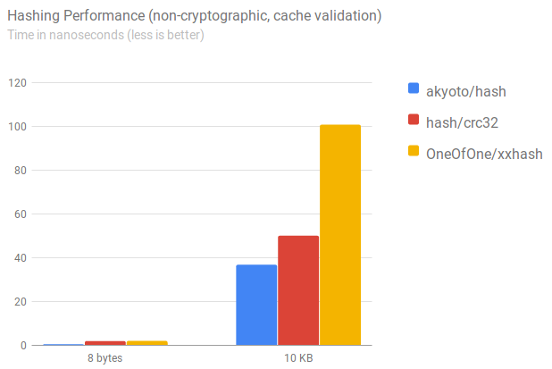

# {name}

{go:header}

Ultra-fast hashing of bytes, strings and reader contents. The algorithm is meant to be used for cache (in)validation.

## Benchmarks

[](https://github.com/akyoto/hash-benchmarks)

## Usage

### []byte

```go
x := hash.Bytes([]byte("Hello World"))
```

### string

```go
x := hash.String("Hello World")
```

### io.Reader

```go
x := hash.Reader(file)
```

## Collisions

The algorithm in its current state has a possible collision if equally sized payloads bigger than 64 bytes contain a +1/-1 diff on an 8-byte index difference.
If this turns out to be a problem for your use case, please consider other hash libraries or feel free to contribute and [send a PR](https://github.com/akyoto/hash/pulls).

{go:footer}
